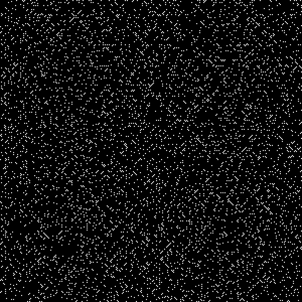

# Prime Spirals

This is a TypeScript implementation of Prime Spirals also known as Ulam's Spiral. More information can be found here: [https://www.youtube.com/watch?v=a35KWEjRvc0](The Coding Train), [https://www.youtube.com/watch?v=iFuR97YcSLM](Numberphile) & [https://en.wikipedia.org/wiki/Ulam_spiral](Wikipedia).

This particular implementation supports the ability to generate spirals that do not center around zero. So if you desire to generate a segment of the spiral 100 Million numbers away from 1 then you can. This possible as the spiral is generated using an algorithm capable of converting rows & columns into a number on the spiral.

To use this clone this repository and compile with TypeScript.

*Spiral Centered @ (0, 0)*

*Spiral Centered @ (100, 100)*

*Spiral Centered @ (1000, 1000)*

*Spiral Centered @ (10000, 10000)*

*Spiral Centered @ (100000, 100000)*

## Contributing
Pull requests are welcome. For major changes, please open an issue first to discuss what you would like to change.

## License
[MIT](https://choosealicense.com/licenses/mit/)